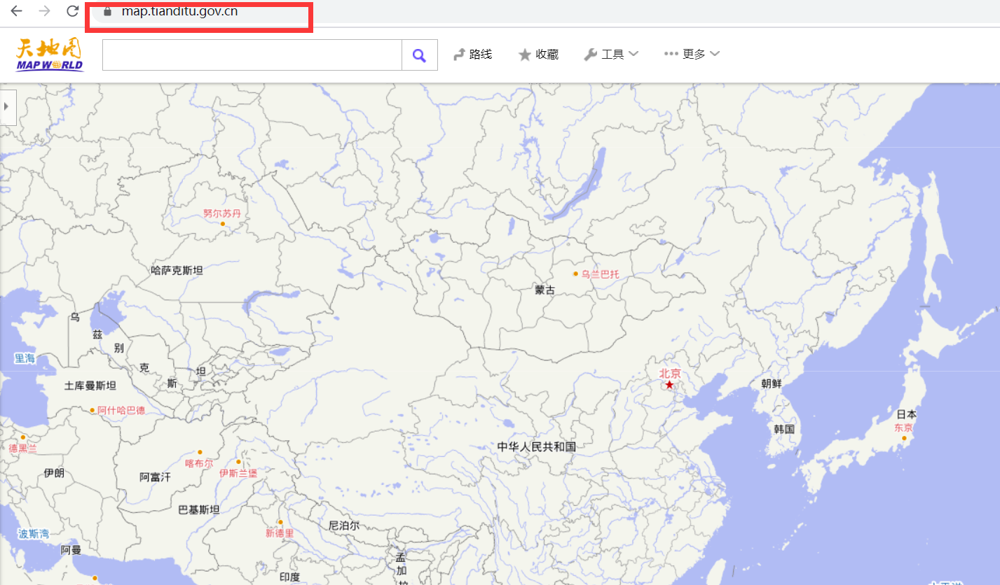
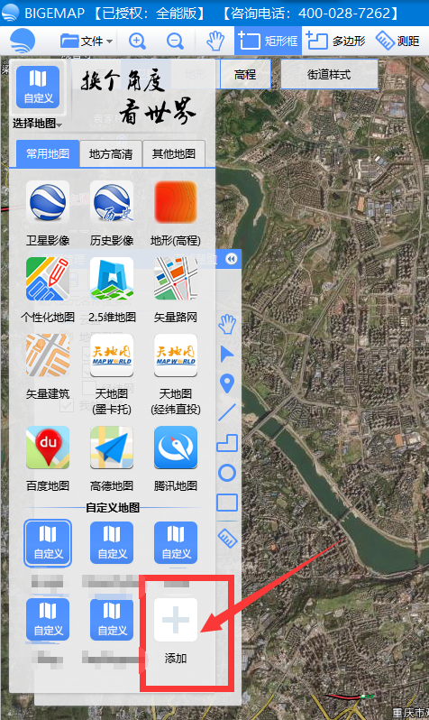
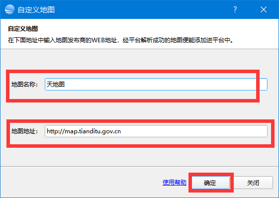

# Bigemap如何添加卫星影像在线地图服务

在我们的工作中，我们经常需要用到第三方地图源的地图来辅助我们的作业，在此，BIGEMAP提供加载第三方数据源作为低图，步骤如下：

 第一  打开浏览器，找到你要访问的地图的URL地址，并且确认可以正常在浏览器中访问；浏览器中不能访问，同样也不能在软件中访问。

以下为常用地图源地址：

```
   mapbox:  https://www.mapbox.com/contribute/ 含：卫星影像、电子地图

    Arcgis ：https://livingatlas.arcgis.com/wayback       包含：卫星影像、历史影像

  mapquest：http://www.mapquest.com   包含：卫星影像

    Arcgis Online：https://livingatlas.arcgis.com/wayback    包含：卫星影像、电子地图、地形图
    
    天地图：http://map.tianditu.gov.cn  包含：卫星影像、电子地图、地形图
    
    谷歌地球: http://kh.google.com         包含：卫星影像、历史影像
    
    谷歌地图: http://maps.google.com          包含：卫星影像、电子地图、地形图    
    
    必应地图（bing）：http://cn.bing.com/maps    包含：卫星影像、电子地图、地形图    包含：卫星影像、电子地图、地形图
    
    Opencycle：http://www.opencyclemap.org  包含：等高线地形图
    
    OpenStreet：http://www.openstreetmap.org         包含：电子地图
    
    腾讯地图：http://map.qq.com              包含：卫星影像、电子地图、地形图
    
    搜狗地图：http://map.sogou.com        包含：卫星影像、电子地图、地形图
```

http://map.tianditu.gov.cn
https://www.mapbox.com/contribute/
http://www.mapquest.com
https://livingatlas.arcgis.com/wayback
http://services.arcgisonline.com
http://kh.google.com
http://maps.google.com
http://cn.bing.com/maps
http://www.opencyclemap.org
http://www.openstreetmap.org
http://map.qq.com
http://map.sogou.com

其他地图：

```
    全球地标覆盖：http://globeland30.org/     包含:耕地、草地、森林、湿地、苔原、人造地表、裸地等等
    
    国家地质图数据：http://www.ngac.org.cn/DataSpecial/geomap.html  包含：地质图、水资源图、矿产图、构照图
    
    全球海图：http://www.shipxy.com/     包含：港口、等深线
```

在浏览器输入以上地址，如果可以正常打开地图，则表示可以访问到，如下图:



   浏览器正常打开访问。

第二步：添加到BIGEMAP软件中，如下图：

左上角【选择地图】里面有个“添加地图按钮”，如下图:



第三步： 点击 添加，如下图：



点击【确定】按钮，就添加成功了。

添加成功 就可以在BIGEMAP中正常访问了。

————————————————

版权声明：本文为CSDN博主「Bigemap」的原创文章，遵循CC 4.0 BY-SA版权协议，转载请附上原文出处链接及本声明。

原文链接：https://blog.csdn.net/bigemap/article/details/120349831