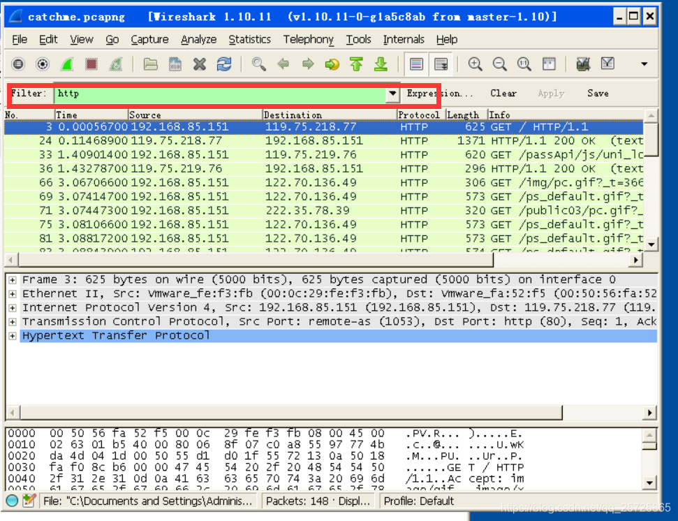
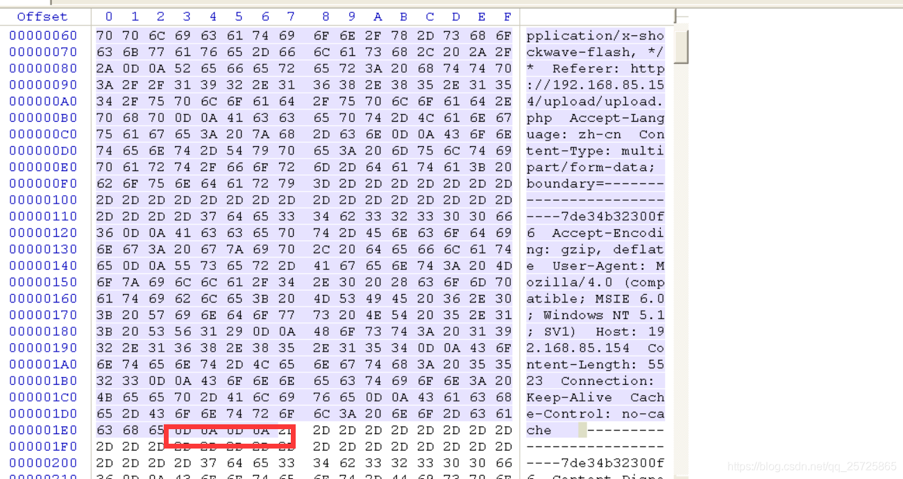

# Wireshark 文件还原 #

Wireshark的功能上来看，只是监听网络流量信息并完整的记录下来，起到还原现场的作用。Winhex是一款非常优秀的16进制收费的编辑器。本节使用的是winhex的评估版本，可以满足本实验需要。如果想对winhex有更深层次的了解，建议去官方网站上进行详细了解。

 

实验情景：

黑客A通过ARP欺骗，使用wireshark获取了整个局域网内的网络流量信息。无意之中，他发现有人在某个网站上上传了一份文件。但是他不知道怎么样通过wireshark去还原这份文件，没办法，他将监听到的数据包保存为了一份wireshark的监听记录，将通过以下三个任务完成那份上传文件的还原。

 

打开桌面上的实验数据包

 

 

 

使用wireshark的filter模块对数据包进行过滤

 

 

观察过滤的数据包，看到upload怀疑是上传页面

 

 

 

进一步过滤post数据包

 

 

 

 

确定post包是否上传了文件，如果上传了文件则将数据dump下来

 

进一步分析数据包，发现确实是上传了文件

 

 

并且由于数据包较大，TCP协议对其进行了切片，分成了5个片，点击frame可以看到每个片的内容，通过wireshark的流式会话将其还原，可以直接在一个包里面看到所有数据

 

由于其中包含了服务器响应部分，将其过滤为只剩请求

 

 

保存原始文件，现在信息原始信息文件已经拿到，选择raw类型表示用二进制方式保存

 

 

 

将保存的原始文件用winhex打开

 

 

 

可以看到里面是有多余的请求信息等，通过wireshark可以看到，在图片数据前面有两个换行符，换行符用十六进制表示是 0D 0A.因为有两个，所以，我们在图片附近寻找0D 0A 0D 0A.后面的部分就表示图片的开始。

 

 

 

 

这个时候需要去掉多余的信息，从数据最开始处按住alt+1开始选择，一直到0A这里，按alt+2表示选取结束（直接用鼠标选择也可以），按住del删除多余数据包

 

 

 

 

然后在到数据尾部，有一个换行符，同样删除掉

 

 

然后ctrl+s保存

 

 

将文件改名为png后缀打开

 
————————————————

版权声明：本文为CSDN博主「安全我只会360」的原创文章，遵循CC 4.0 BY-SA版权协议，转载请附上原文出处链接及本声明。

原文链接：https://blog.csdn.net/qq_25725865/article/details/106176529