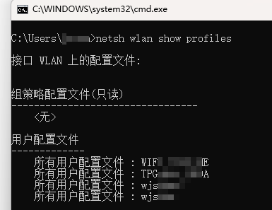
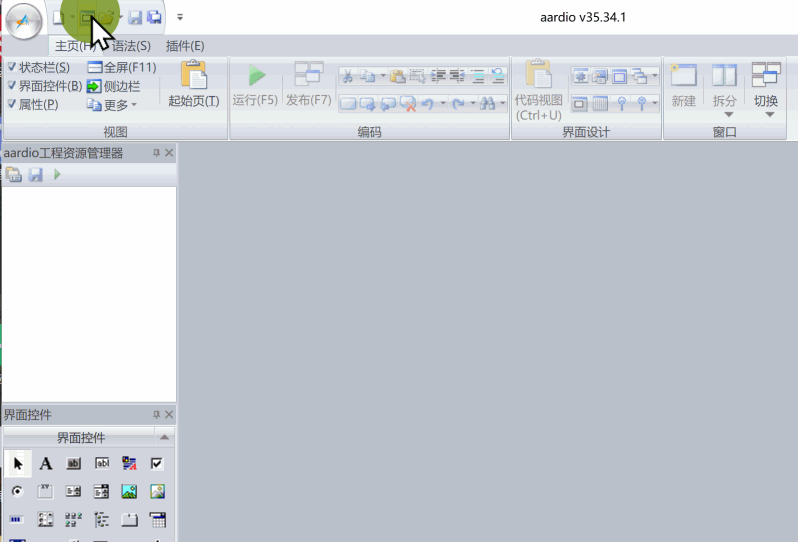
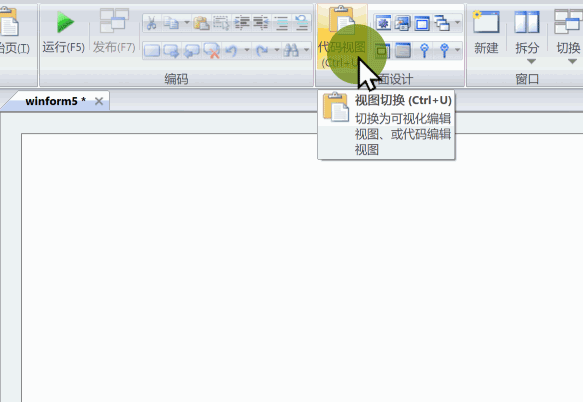
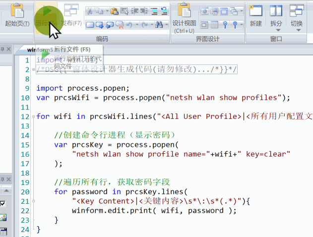
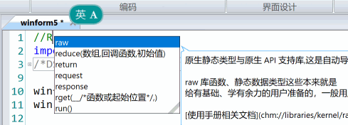
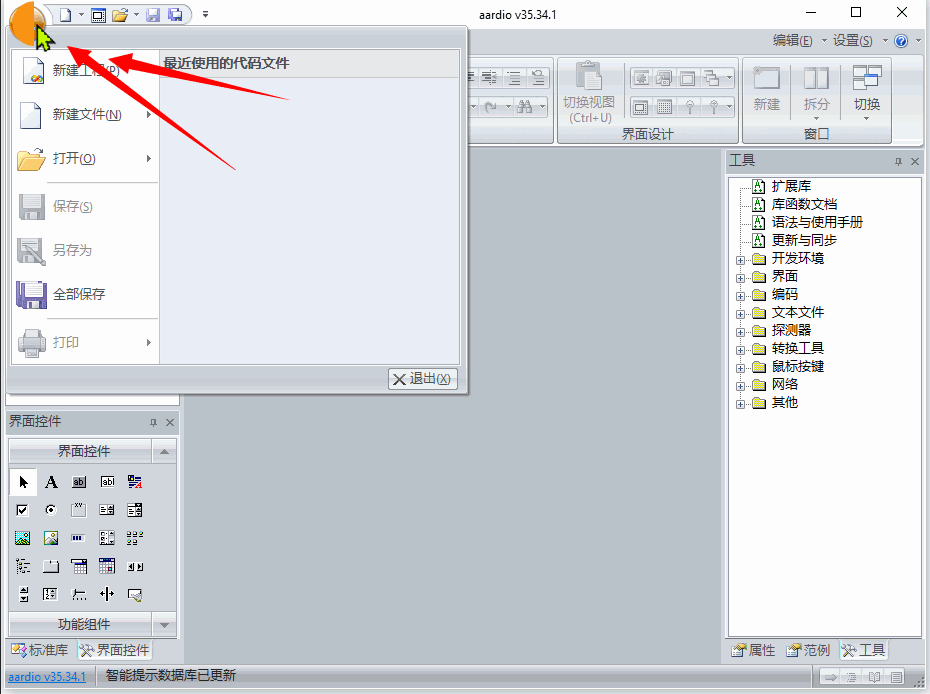
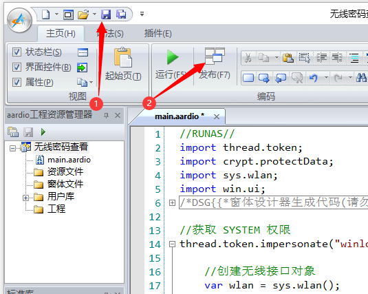

# 写个查看无线密码的独立 EXE 程序

原创2022-11-08 08:19·[aardio](https://www.toutiao.com/c/user/token/MS4wLjABAAAA6V3GhZ2y8hJUJhD7Vu83IY_BSisSZR1kz54kmiG11wUQmnup_vzNnOE_w4i3vBUK/?source=tuwen_detail)

本文分为 2 个部分：

1、调用命令行工具 netsh ，使用进程管道读取 Windows 无线连接密码。

2、不用 netsh，获取并解密 Windows 无线连接密码。

# 方法一：调用 netsh 获取无线密码

在系统命令行中输入：

```
netsh wlan show profiles
```

显示结果如下：



在 aardio 中用下面的代码创建命令行进程：

```
var prcs = process.popen("netsh wlan show profiles");
```

这不会再显示命令行程序的黑窗口（控制台窗口）。

返回的 prcs 提供了很多用于操作进程管道的函数，我们可以如下遍历所有输出行，并查找 Wi-Fi 连接名：

```
//创建命令行进程（显示 WIFI 连接名）
var prcs = process.popen("netsh wlan show profiles");

//遍历进程所有输出项，参数指定模式匹配表达式
for wifi in prcs.lines("<All User Profile>|<所有用户配置文件>\s*\:\s*(.*)"){  

}
```

wifi 就是拿到的 Wi-Fi 连接名。

重点看一下这个模式表达式：

```
"<All User Profile>|<所有用户配置文件>\s*\:\s*(.*)"
```

**知识点：**

- "<All User Profile>|<所有用户配置文件>" 用于匹配 "All User Profile" 或者 "所有用户配置文件"。
- "\s" 表示空白字符，"\s*" 表示任意个空白字符。
- "\:" 表示 ":" 本身，反斜杠为转义符，不加反斜杠的 ":" 匹配一个中文字符（多字节）。
- "." 表示任意单字节字符，".*" 表示任意个数的任意字符。
- 括号 () 用于提取捕获结果到返回值，上面的 "(.*)" 就是提取冒号后面的 Wi-Fi 连接名并存储到循环变量 wifi 。

「模式表达式」类似简化版「正则表达式」，速度也更快。

下面我们将获取到的 Wi-Fi 连接名输出到界面上。首先用 aardio 创建一个窗口，然后拖一个文本框控件上去。



然后切换到代码视图：



输入代码如下：

```
import process.popen;
var prcs = process.popen("netsh wlan show profiles"); 

for wifi in prcs.lines("<All User Profile>|<所有用户配置文件>\s*\:\s*(.*)"){  
    winform.edit.print(wifi);
}
```

下面我们再用同样的方法，加几句代码 获取 Wi-Fi 连接密码。

```
for wifi in prcs.lines("<All User Profile>|<所有用户配置文件>\s*\:\s*(.*)"){  

    //创建命令行进程（显示密码）
    var prcsKey = process.popen(
        "netsh wlan show profile name="+wifi+" key=clear"
    );

    //遍历所有行，获取密码字段
    for password in prcsKey.lines(
        "<Key Content>|<关键内容>\s*\:\s*(.*)"){
        winform.edit.print( wifi, password );
    }
}
```

运行程序看看效果：



# 方法二：不用 netsh，获取并解密无线密码

首先要在代码第一行加上 //RUNAS// 以获取管理权限：



然后我们添加下面的代码获取所有无线连接：

```
import sys.wlan;
var wlan = sys.wlan();

//遍历全部无线连接
for wifi,guid,description,flags,access,xmlProfile in wlan.eachProfile(){

    //xmlProfile 是 XML 配置对象
    var km = xmlProfile.queryEle( 
        tagName = "keyMaterial"
    );

    //获取密码：也就是keyMaterial 元素内的文本
    var password = km.innerText();

    winform.edit.print(wifi,password)
}
```

运行程序，显示的密码是加密的，添加下面的代码解密：

```
import crypt.protectData;

var password = crypt.protectData.decrypt(
    km.innerText()
)
```

但是解密无线密码需要 SYSTEM 权限，所以我们需要用下面的代码夺权：

```
import thread.token;
thread.token.impersonate("winlogon.exe",function(){

})
```

再将查看无线密码的代码移动到夺权代码内部，最终完成的全部代码如下：

```
//RUNAS//
import thread.token;
import crypt.protectData;
import sys.wlan;
import win.ui;
/*DSG{{*/
var winform = win.form(text="无线密码查看工具";right=590;bottom=368)
winform.add(
edit={cls="edit";left=26;top=26;right=558;bottom=337;edge=1;multiline=1;z=1}
)
/*}}*/

//获取 SYSTEM 权限
thread.token.impersonate("winlogon.exe",function(){

    //创建无线接口对象
    var wlan = sys.wlan();

    //遍历全部无线连接
    for wifi,guid,description,flags,access,xmlProfile in wlan.eachProfile(){

        //xmlProfile 是 XML 配置对象
        var km = xmlProfile.queryEle( 
            tagName = "keyMaterial"
        );

        //获取密码，keyMaterial 元素内的文本 
        var password = km.innerText();

        //解密
        password = crypt.protectData.decrypt(password);

        //清除尾部 '\0'
        password = string.str(password);

        //显示结果
        winform.edit.print(wifi,password)
    }    
})

winform.show();
win.loopMessage();
```

# 发布为独立 EXE 程序

在 aardio 中新建窗口工程：



然后将前面的源代码复制粘贴到 main.aardio 内，然后按保存。



然后点『发布』就可以了。
