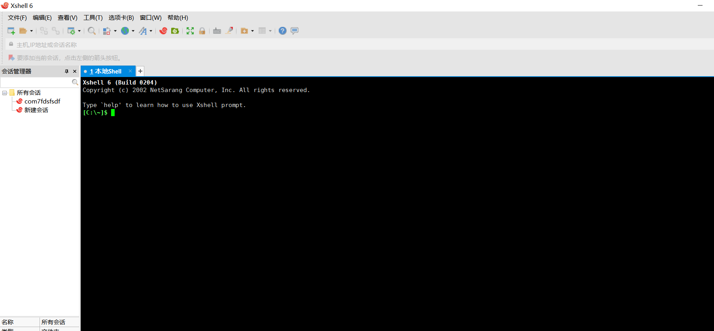

# 分享一份嵌入式软件工具清单 #

大家好，我是ZhengN。

今天给大家分享一份嵌入式软件清单：

## 1、BowPad ##

我们常常需要一些轻量级的文本编辑器，用来编写少许代码或者看log等。BowPad就是一个超级好用的、小巧的文本编辑器。

详细内容可阅读往期推文：分享一个超级好用的文本编辑器!

BowPad源码/安装包下载地址：

https://github.com/stefankueng/BowPad

## 2、keil ##

keil大家都熟悉，单片机开发IDE，我们学习单片机装的第一个软件应该就是keil吧~

## 3、VSCode ##

VSCode（全称：Visual Studio Code）是一款由微软开发且跨平台的免费源代码编辑器。该软件支持语法高亮、代码自动补全（又称 IntelliSense）、代码重构、查看定义功能，并且内置了命令行工具和 Git 版本控制系统。用户可以更改主题和键盘快捷方式实现个性化设置，也可以通过内置的扩展程序商店安装扩展以拓展软件功能。

一些调查中，VSCode被认为是最受开发者欢迎的开发环境。单片机开发中，也有很多人喜欢使用VSCode来写代码，用keil来编译，甚至是基于VSCode搭建STM32开发环境。

在Ubuntu中进行嵌入式开发，VSCode应该更是我们的第一选择。

## 4、VS ##

不同于VSCode，Visual Studio是一个IDE，我们可以装一个以备不时之需，比如验证C程序或是进行C#程序开发等。一些与嵌入式相关的模拟器也是基于Visual Studio，比如往期的两篇推文中我们有介绍：

[手头上无LCD却又急着开发UI？LCD模拟器了解一下](https://www.toutiao.com/i6985920238458208805/?group_id=6985920238458208805)

[基于vs2019的lvgl模拟器使用](https://www.toutiao.com/i6948407425188037127/?group_id=6948407425188037127)

## 5、MinGW ##

如果我们装Visual Studio仅仅只是为了验证C程序的话，我们可以不装，Visual Studio太重量级了。我们可以装VSCode+MinGW就可以了。

	https://sourceforge.net/projects/mingw/

MinGW是 Minimalist GNU for Windows 的缩写。它是一个可自由使用和自由发布的Windows特定头文件和使用GNU工具集导入库的集合。其包含gcc工具，可以使用gcc工具来编译我们的C代码。

MinGW 提供了一套完整的开源编译工具集（如gcc等工具），以适合 windows 平台应用开发，且不依赖任何第三方C运行时库。

## 6、Source Insight ##

平时我们都要阅读一些代码，虽然我们也可以使用IDE或者代码编辑器如VSCode，但是阅读代码的效率可能较低。所以需要安装一个代码阅读器。

Source Insight实质上是一个支持多种开发语言（java,c ,c 等等）的编辑器，只不过由于其查找、定位、彩色显示等功能的强大，常被我们当成源代码阅读工具使用。

## 7、VMWare ##

我们要进行嵌入式Linux开发，除了装双系统之外，我们可以装一个虚拟机软件，在上面运行Linux系统。

虚拟机软件也有好几个，我习惯使用VMWare。

当然，除了虚拟机之外，还有其它的方式。比如：WSL（Windows下的Linux子系统），这个我还没用过，不知道好不好用。

## 8、Git ##

Git是一个开源的分布式版本控制系统，可以有效、高速地处理从很小到非常大的项目版本管理。

Git相关推文：

[嵌入式必备之Git的使用](https://www.toutiao.com/i6909106528436011534/?group_id=6909106528436011534)

## 9、Beyond Compare ##

我们需要一些对比工具来对比两份代码。

Beyond Compare是一个能很强大的对比工具。其不仅仅是一个代码对比软件，还可以用来对比表格、MP3、注册表，甚至是图标等对比。

当然，也还有其它一些优秀的对比工具，挑一个顺手的用。

相关推文：

[分享一款小巧好用的代码对比工具](https://www.toutiao.com/i7014095534780629507/?group_id=7014095534780629507)

[哪款代码对比工具比较好用？](https://www.toutiao.com/i6963651328627180065/?group_id=6963651328627180065)

## 10、串口助手 ##

串口助手是我们嵌入式开发必备的工具，有很多选择。

这里推荐几个我觉得好用的：

- MobaXTerm
- xshell
- 友善串口调试助手
- 单片机多功能调试助手
- 
## 11、STM32Cube ##

ST出品的工具。

**（1）STM32CubeMX**

STM32配置工具。

**（2）STM32CubeIDE**
STM32集成开发环境。

**（3）STM32CubeProgrammer**
STM32烧录工具。

## 12、RT-Thread Studio ##

一站式的 RT-Thread 开发工具，通过简单易用的图形化配置系统以及丰富的软件包和组件资源，让物联网开发变得简单和高效。

早期版本相关推文：

[「RT-Thread」OneNet软件包的使用](https://www.toutiao.com/i6834314270067393028/?group_id=6834314270067393028)

[RT-Thread Studio使用体验：真香](https://www.toutiao.com/i6777694903401972236/?group_id=6777694903401972236)

[「RT-Thread笔记」BH1750软件包的使用](https://www.toutiao.com/i6835773649639703047/?group_id=6835773649639703047)

## 13、FlyMCU ##

FlyMcu仿真软件是stm32串口烧写器，FlyMcu仿真软件连接上通讯所使用的串口，能够很方便地烧写程序。

14、QT Creator

Qt Creator是跨平台的集成开发环境（IDE），旨在为开发者带来最好的体验。 Qt Creator可在Windows、Linux和macOS桌面操作系统上运行，并允许开发人员在桌面、移动和嵌入式平台创建应用程序。

相关推文：[手把手教你编写你的第一个上位机](https://www.toutiao.com/i6954011391325979169/?group_id=6954011391325979169)

## 15、PyCharm ##

全民Python。Python我们可以作为一门辅助语言进行学习。

PyCharm 是一款功能强大的 Python 编辑器，具有跨平台性。

以上就是一些嵌入式开发相关的软件分享。如果文章对你有帮助，麻烦帮忙转发，谢谢！

往期推荐：

[分享一份不错的嵌入式资料汇总贴](https://www.toutiao.com/i6998471512437129758/?group_id=6998471512437129758)