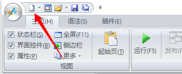
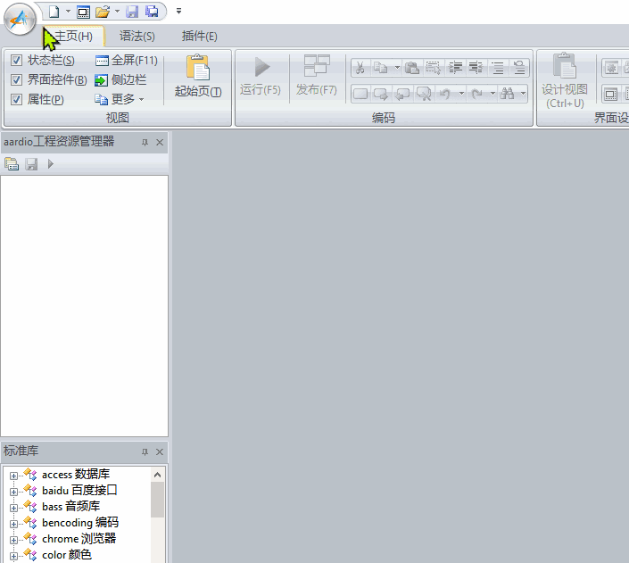
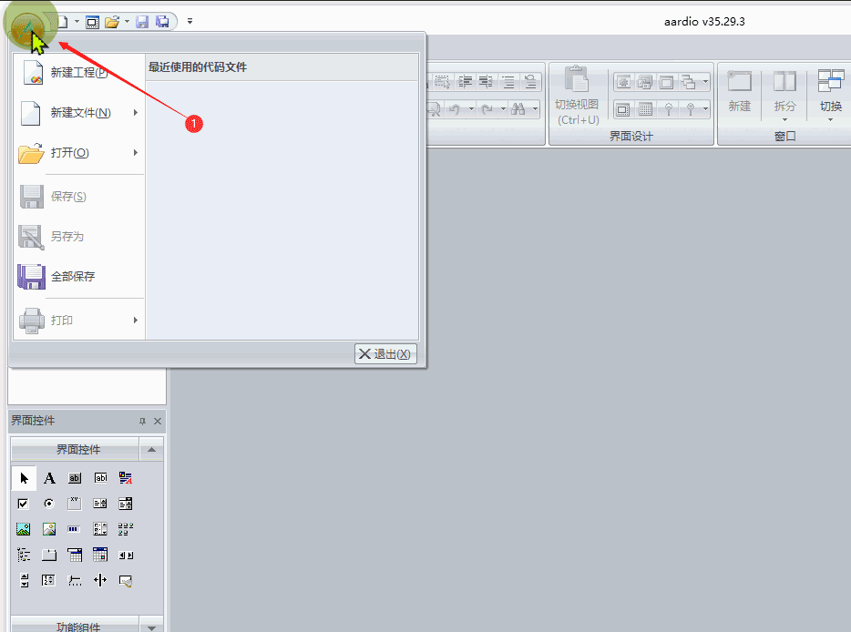
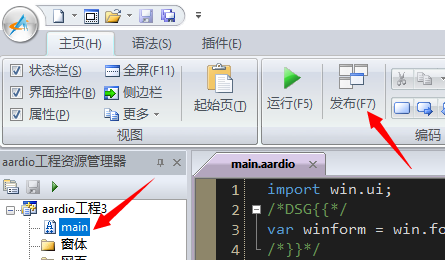
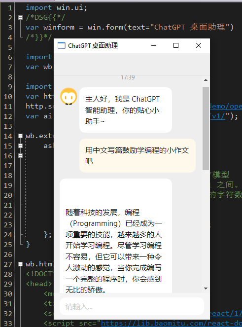

# 快速开发 ChatGPT 桌面智能助理

我们使用轻量开发环境 aardio ，体积只有几 MB，下载就可以编程，不需要任何复杂的配置。

# 调用 ChatGPT 接口

打开 aardio ，点左上角**『新建控制台』**按钮：




创建一个控制台程序：




输入下面的代码调用 OpenAI 接口：

```
import console.int;
import web.rest.jsonClient;

//创建 API 客户端
var http = web.rest.jsonClient(); 

//设置 Key 或者获取 Key 的网址。
http.setAuthToken("http://api.aardio.com/demo/openai/token");

//引入 OpenAI 接口
var ai = http.api("https://api.openai.com/v1/");

//调用 API 
var ret = ai.completions({
    "prompt": "现在几点了",//发送问题
    "model": "text-davinci-003",//模型
    "temperature": 0.8,//热度，0~1 之间。
    "max_tokens": 2048,//最大允许的字符数量   
})
 
//显示回复
console.log( ret.choices[1].text )
```

aardio 调用 Web API 接口的代码非常简单，甚至不需要封装 OpenAI 扩展库。

# 实现 ChatGPT 桌面智能助理

为了生成体积更小的独立 EXE 程序，我们调用系统自带的 WebView2，并且用 React + ChatUI 实现界面，几句代码就可以搞定。

首先在 aardio 中创建 WebView2 工程：




然后在 main.aardio 中输入下面源代码：

```
import win.ui;
/*DSG{{*/
var winform = win.form(text="ChatGPT 桌面助理") 
/*}}*/

import web.view;
var wb = web.view(winform);

import web.rest.jsonClient;
var http = web.rest.jsonClient(); 
http.setAuthToken("http://api.aardio.com/demo/openai/token");
var ai = http.api("https://api.openai.com/v1/");
 
wb.external = {
	ask = function(prompt){
		var ret = ai.completions({
  			"prompt": prompt,//发送问题
  			"model": "text-davinci-003",//模型 
  			"temperature": 0.8,//热度，0~1 之间。
  			"max_tokens": 2048,//最大允许的字符数量   
		})
 		
		if(ret)return ret.choices[1].text;
	};	
} 

wb.html = /**
<!DOCTYPE html><html>
<head>
	<meta charset="utf-8" />
	<title>WebView2</title> 
	<script src="https://lib.baomitu.com/react/17.0.2/umd/react.development.js"></script>
	<script src="https://lib.baomitu.com/react-dom/17.0.2/umd/react-dom.development.js"></script>
	<script src="https://lib.baomitu.com/chatui-core/2.4.2/index.min.js"></script> 
	<link rel="stylesheet" href="https://lib.baomitu.com/chatui-core/2.4.2/index.min.css"> 
	<script src="https://lib.baomitu.com/babel-standalone/7.18.13/babel.min.js"></script>
	<style type="text/css">html,body,#app{height:100%}</style>
</head>
<body>  

<script type="text/babel"> 
	const { useState,useEffect,useCallback,useRef } =  React;  
	const { default: Chat, Bubble, useMessages } = ChatUI;  
	
	const App = () => {
  		const { messages, appendMsg, setTyping } = useMessages([{
    		type: 'text',
    		content: { text: '主人好，我是 ChatGPT 智能助理，你的贴心小助手~' },
    		user: { avatar: 'https://gw.alicdn.com/tfs/TB1DYHLwMHqK1RjSZFEXXcGMXXa-56-62.svg' },
  		}]);
		
  		function handleSend(type, val) {
    		if (type === 'text' && val.trim()) {
      			appendMsg({
        			type: 'text',
        			content: { text: val },
        			position: 'right',
      			});
			
      			setTyping(true);
      			
      			aardio.ask(val).then( text=>{
      				appendMsg({
          				type: 'text',
          				content: { text: text },
        				});	
      			}) 
    		}
  		}
		
  		function renderMessageContent(msg) {
    		const { content } = msg;
    		return <Bubble content={content.text} />;
  		}
		
  		return (
    		<Chat
      		navbar={{ title: '' }}
      		messages={messages}
      		renderMessageContent={renderMessageContent}
      		onSend={handleSend}
    		/>
  		);
		};
		
	ReactDOM.render(<App />, document.querySelector('#app')); 
</script>
<div id="app"></div>
**/

winform.show();
win.loopMessage();
```

点击发布就可以生成独立 EXE 程序了。




程序运行界面如下：




请注意上面源码中的 key 仅供测试（网址返回的 key 是临时性的），请替换为自己申请的 key 。网上有很多 ChatGPI 注册教程，注册非常简单，参考教程注册以后可以申请免费 key 。