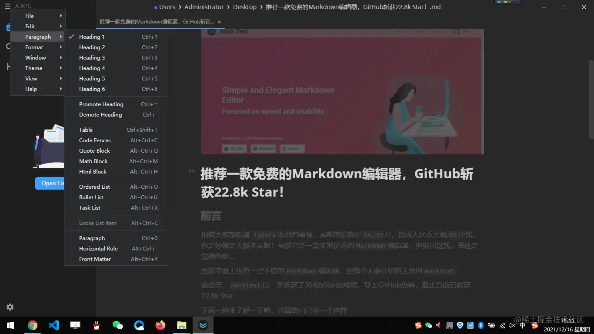

# 推荐一款免费的Markdown编辑器，GitHub斩获22.8k Star #

**前言**

相信大家都知道 Typora收费的事情，买断的价格是14.99刀，算成人民币大概89块钱，但是好像只是大版本买断！虽然它是一款非常优秀的Markdown编辑器，但要出这钱，我还是觉得肉疼...

虽然市面上也有一些不错的Markdown编辑器，但我今天在掘金瞎逛的时候，看到一篇叫：这款 Markdown 编辑器开源了！的文章，说的是marktext，前些天它以一天斩获了304的Star的成绩，登上GitHub热榜

我看了看觉得还不错，截止目前已收获22.8k Star，于是自己用了

下面一起来了解一下吧，也算给自己多一个选择

**介绍**

**官网和GitHub地址**

- 官网：marktext.app/
- GitHub：github.com/marktext/ma…

**总结什么是marktext**

什么是marktext，官方已有介绍

推荐一款免费的Markdown编辑器，GitHub斩获22.8k Star
大概总结为以下5点：

- marktext是下一代 Markdown 编辑器
- 是一个简单优雅的开源 Markdown 编辑器
- 专注于速度和可用性
- 可用于 Linux、macOS 和 Windows
- 目标最新版本为0.16.3

**特性**

**简洁**

实时预览（所见即所得）和简洁明了的界面，使您获得无干扰的写作体验

推荐一款免费的Markdown编辑器，GitHub斩获22.8k Star

**Markdown扩展**

支持 CommonMark 规范和 GitHub Flavored Markdown 规范，以及Markdown扩展，例如数学表达式（KaTeX）、front matter 和 emoji

推荐一款免费的Markdown编辑器，GitHub斩获22.8k Star

**导出文件格式**

可以导出为 HTML 和 PDF 文件

推荐一款免费的Markdown编辑器，GitHub斩获22.8k Star

**6种配色好看的主题**

marktext 包含六种美观的主题：Cadmium Light、Dark、Graphite Light、Material Dark 、One Dark、Ulysses Light，分别依次对应如下：

推荐一款免费的Markdown编辑器，GitHub斩获22.8k Star

**各种编辑模式**

源代码模式

推荐一款免费的Markdown编辑器，GitHub斩获22.8k Star

打字机模式

推荐一款免费的Markdown编辑器，GitHub斩获22.8k Star

专注模式

推荐一款免费的Markdown编辑器，GitHub斩获22.8k Star

**其他**

快捷键也比较完善，总体都跟之前用的差不多，很容易习惯！

推荐一款免费的Markdown编辑器，GitHub斩获22.8k Star

**个人使用体验**

其实总体还是满意的

就是使用过程中有一个问题是，装好后我什么都没干，关闭是提醒我们保存，而且打开的时候特别慢，不知道是不是我的电脑的原因，我还特意去提了一个Issues

推荐一款免费的Markdown编辑器，GitHub斩获22.8k Star

五星给4星吧

你会给几星呢？

如果可以，也欢迎大家给我推荐一个你用得最喜欢的一个，让我了解了解

**THE END**

以上就是本文的所有内容，如有问题欢迎留言~