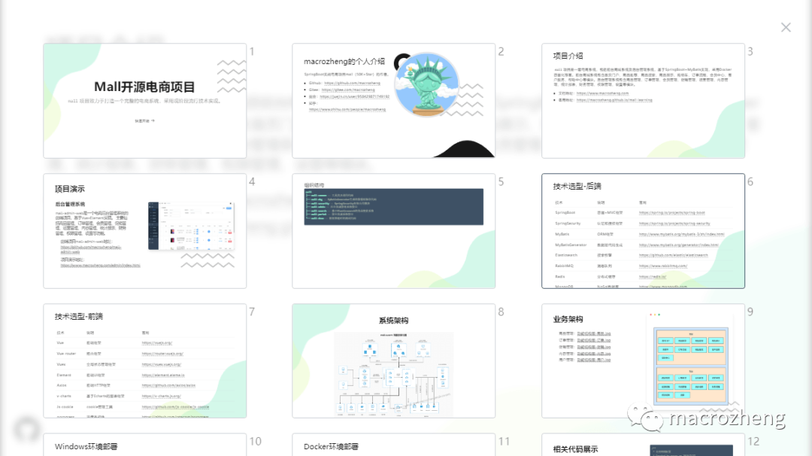

# 牛逼！Markdown还能这么玩？这款开源神器绝了！

Original 梦想de星空 macrozheng *2022-11-09 09:02* *Posted on 江苏*

收录于合集#开源项目精选60个

> Markdown是一款轻量级标记语言，由于它易读易写的特性，很多程序员用它来写项目文档。其实Markdown的功能不止于此，结合一些工具使用还可以用来做PPT，今天带大家使用Markdown来做一个PPT，看看到底有多炫酷！

## Slidev简介

Slidev是一款专门为开发者打造的演示文稿工具，目前在Github上已有`23K+Star`。通过Slidev，我们只要使用熟悉的Markdown就可以做出炫酷的PPT来，同时拥有支持HTML和Vue组件的能力，并且能够呈现像素级完美的布局。

它的主要功能如下：


下面是我用Slidev制作的`mall项目介绍PPT`的效果图，还是挺炫酷的大家可以看下！


## 安装

> 在使用Slidev制作PPT之前，我们需要先安装下它的环境。

- 确保电脑上已经安装了`NodeJS 14`以上版本，然后使用如下命令初始化项目：

```
npm init slidev
```

- 安装过程中我们需要输入项目名称`mall-intro-sldev`，安装完成后会自行启动；


- 如果项目被关闭了，也可以使用如下命令运行；

```
npm run dev
```

- 当然你也可以安装Slidev的CLI工具后使用`slidev`命令来运行；

```
npm i -g @slidev/cli
```

- 安装完成后项目默认运行在`3030`端口，访问地址：http://localhost:3030/


- 由于是使用Markdown来编写PPT，你可以使用任意的Markdown编辑器，比如Typora或者MarkText，这里使用的是VSCode，因为它有Slidev专属的插件可以使用；


- VSCode的使用这里就不再赘述了，具体可以参考之前的文章[推荐一款微软出品的开发神器，体验不输IDEA！](https://mp.weixin.qq.com/s?__biz=MzU1Nzg4NjgyMw==&mid=2247502048&idx=1&sn=c11a92e9372caf3784b8811fe879e8bb&scene=21#wechat_redirect)

- 安装完成后直接用VSCode打开Slidev初始化好的文件夹即可，打开默认的PPT文件`slides.md`，然后打开插件视图即可开始编辑。


## 使用

> 环境搭建完毕，下面我们就可以开始制作PPT了，这里以mall项目的介绍PPT为例。

### 使用主题

- 在使用Slidev之前，我们最好选择一个炫酷的主题，Slidev提供的主题还是挺多的，选择一个自己喜欢的就好；


- 这里我们使用`Penguin`这个主题，使用如下命令安装主题；

```
npm i slidev-theme-penguin
```

- 如果遇到如下提示，需要安装`sass`；

```
# 提示信息：Preprocessor dependency "sass" not found. Did you install it?
npm i sass
```

- 安装完成后，我们在Markdown文档顶部修改`theme`属性即可使用主题。

```
---
theme: penguin
---
```

### 使用布局

> 通过布局我们可以很好地控制PPT中的内容，不同的主题也拥有不同的布局，这里以`penguin`主题为例。

- 我们先来编写一个PPT的封面页，使用的是`intro`布局，`---`符号之间的是页面配置，`---`之后的是PPT中的内容；

```
---
# 配置主题
theme: penguin
# 幻灯片的配色方案，可以使用 'auto'，'light' 或者 'dark'
colorSchema: 'auto'
layout: intro
# 代码语法高亮设置，可以使用 'prism' 或 'shiki' 方案
highlighter: shiki
# 用于主题定制
themeConfig:
# 配置封面页左上角Logo
logoHeader: '/logo_round.png'
# 配置全局左下角Logo
eventLogo: '/github.png'
# 配置全局左下角Logo跳转路径
eventUrl: 'https://github.com/macrozheng'  
css: unocss
---

# Mall开源电商项目

`mall`项目致力于打造一个完整的电商系统，采用现阶段流行技术实现。

<div class="pt-12">
  <span @click="next" class="px-2 p-1 rounded cursor-pointer hover:bg-white hover:bg-opacity-10">
    快速开始 <carbon:arrow-right class="inline"/>
  </span>
</div>
```

- 由于我们将新的PPT内容放到了`mall-slidev.md`文件中，因此启动时需要使用`slidev mall-slidev.md`命令，展示效果如下；


- 我们再来编写一个`presenter`布局，可用于展示PPT作者的信息；

```
---
layout: presenter
# 配置作者头像
presenterImage: '/logo.png'
---

# macrozheng的个人介绍

SpringBoot实战电商项目mall（50K+Star）的作者。

- Github：https://github.com/macrozheng
- Gitee：https://gitee.com/macrozheng
- 掘金：https://juejin.cn/user/958429871749192
- 知乎：https://www.zhihu.com/people/macrozheng
```

- 演示者布局展示如下；


- 如果没有特殊需求的话，可以使用默认布局；

```
---
layout: default
---

# 项目介绍

`mall`项目是一套电商系统，包括前台商城系统及后台管理系统，基于SpringBoot+MyBatis实现，采用Docker容器化部署。前台商城系统包含首页门户、商品推荐、商品搜索、商品展示、购物车、订单流程、会员中心、客户服务、帮助中心等模块。后台管理系统包含商品管理、订单管理、会员管理、促销管理、运营管理、内容管理、统计报表、财务管理、权限管理、设置等模块。

- 文档地址：[https://www.macrozheng.com](https://www.macrozheng.com)
- 备用地址：[https://macrozheng.github.io/mall-learning](https://macrozheng.github.io/mall-learning)
```

- 默认布局展示如下；


- 如果我们想在PPT中同时展示文本和图片，可以使用`text-image`布局，通过`reverse`属性我们可以控制图片在左还是在右；

```
---
layout: text-image
media: 'http://img.macrozheng.com/mall/project/mall_admin_show.png'
reverse: false
---

# 项目演示

### 后台管理系统

mall-admin-web是一个电商后台管理系统的前端项目，基于Vue+Element实现。 主要包括商品管理、订单管理、会员管理、促销管理、运营管理、内容管理、统计报表、财务管理、权限管理、设置等功能。

- 前端项目mall-admin-web地址：https://github.com/macrozheng/mall-admin-web

- 项目演示地址： [https://www.macrozheng.com/admin/index.html](https://www.macrozheng.com/admin/index.html) 
```

- 文本图片布局展示如下；


- 对于默认布局我们如果不需要配置的话，可以简写成功`---`；

```
---

# 技术选型-后端

| 技术                 | 说明                | 官网                                           |
| -------------------- | ------------------- | ---------------------------------------------- |
| SpringBoot           | 容器+MVC框架        | https://spring.io/projects/spring-boot         |
| SpringSecurity       | 认证和授权框架      | https://spring.io/projects/spring-security     |
| MyBatis              | ORM框架             | http://www.mybatis.org/mybatis-3/zh/index.html |
| MyBatisGenerator     | 数据层代码生成      | http://www.mybatis.org/generator/index.html    |
| Elasticsearch        | 搜索引擎            | https://github.com/elastic/elasticsearch       |
| RabbitMQ             | 消息队列            | https://www.rabbitmq.com/                      |
| Redis                | 分布式缓存          | https://redis.io/                              |
| MongoDB              | NoSql数据库         | https://www.mongodb.com                        |
| LogStash             | 日志收集工具        | https://github.com/elastic/logstash            |
| Kibana               | 日志可视化查看工具  | https://github.com/elastic/kibana              |
| Nginx                | 静态资源服务器      | https://www.nginx.com/                         |
| Docker               | 应用容器引擎        | https://www.docker.com                         |
| Jenkins              | 自动化部署工具      | https://github.com/jenkinsci/jenkins           |
| Druid                | 数据库连接池        | https://github.com/alibaba/druid               |
| OSS                  | 对象存储            | https://github.com/aliyun/aliyun-oss-java-sdk  |
| MinIO                | 对象存储            | https://github.com/minio/minio                 |
| JWT                  | JWT登录支持         | https://github.com/jwtk/jjwt                   |
| Lombok               | 简化对象封装工具    | https://github.com/rzwitserloot/lombok         |
| Hutool               | Java工具类库        | https://github.com/looly/hutool                |
| PageHelper           | MyBatis物理分页插件 | http://git.oschina.net/free/Mybatis_PageHelper |
| Swagger-UI           | 文档生成工具        | https://github.com/swagger-api/swagger-ui      |
| Hibernator-Validator | 验证框架            | http://hibernate.org/validator       
```

- 有时候我们需要PPT内容全部居中，可以使用`new-section`布局；

```
---
layout: new-section
---

# 系统架构


```

- 居中布局展示如下；


- 如果你想将某些内容显示在窗口中的话，还可以使用`text-window`布局，使用`::window::`来分割在窗口中的内容；

```
---
layout: text-window
---

# 业务架构

- 商品管理：[功能结构图-商品.jpg](document/resource/mind_product.jpg)
- 订单管理：[功能结构图-订单.jpg](document/resource/mind_order.jpg)
- 促销管理：[功能结构图-促销.jpg](document/resource/mind_sale.jpg)
- 内容管理：[功能结构图-内容.jpg](document/resource/mind_content.jpg)
- 用户管理：[功能结构图-用户.jpg](document/resource/mind_member.jpg)

::window::


```

- 文本窗口布局展示如下；


- 如果你想实现双列布局的话，可以使用`two-cols`布局，使用`::right::`来分割左右列；

```
---
layout: two-cols
---
```

- 双列布局展示如下：


### 演示功能

- 如果你把鼠标放到PPT的左下角的话，你还会发现Slidev提供了一排功能按钮，可以实现全屏、前进、后退、录制、在线编辑等功能；


- 通过`概览`功能，我们可以查看所有PPT的概览；



- 通过`切换主题`功能，我们可以进行主题切换，比如切换到暗色主题；


- 通过`画图`功能，我们可以对PPT上的重点内容进行标注；


- 通过`在线编辑`功能，我们可以实现PPT内容的在线修改。


## 部署

- Slidev实现静态部署也很简单，直接使用如下命令进行打包，可以通过`--base`指定访问的子路径，在有多个PPT项目需要部署时，使用子路径比较好；

```
slidev build mall-slidev.md --base /mall-slidev/
```

- 打包过程中输出日志如下，注意图片资源最好使用文件存储，不要放在项目目录下；


- 打包完成后，所有静态资源都会输出到`dist`目录下；


- 然后把`dist`目录放入Nginx的`html`目录下，并改名为`mall-slidev`，访问以下路径即可查看PPT。


## 总结

使用Markdown来制作PPT，对程序员来说确实很方便。试想一下当别人还在找PPT文件时，你直接打开一个链接就可以展示，是不是够炫酷！不过Slidev也有一些不足之处，比如需要上下滚动的内容无法完全显示，例如超出屏幕的代码段或者表格，大家使用的时候需要注意下。

## 参考资料

官方文档：https://cn.sli.dev/guide/

## PPT文件地址

https://github.com/macrozheng/mall-learning/tree/master/document/ppt/mall-slidev.md

---

**微信8.0将好友放开到了一万，小伙伴可以加我大号了，先到先得，再满就真没了**

**扫描下方二维码即可加我微信啦，`2022，抱团取暖，一起牛逼。`**


